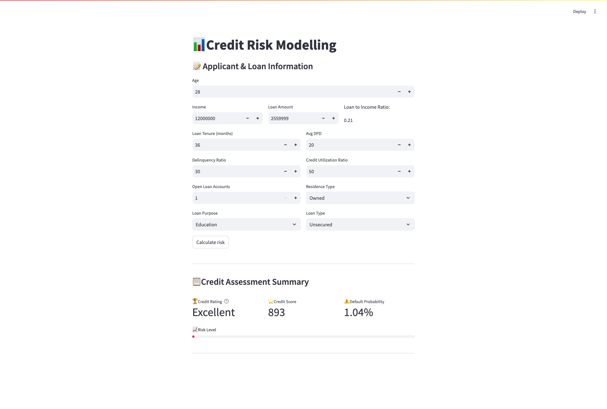

# Credit-Risk-Modelling

##  Project Overview 
This project aims to build an advanced credit risk model, incorporating a credit scorecard that classifies loan applications into Poor, Average, Good, and Excellent categories. The classification is based on criteria similar to the CIBIL scoring system.

##  Dataset Information  

This dataset contains **50,000 loan applicants' records**, including demographic details, financial status, loan details, and credit history. The data is structured with **33 columns**, providing insights into factors influencing credit risk assessment.  

#### **Key Features:**  
- **Customer Information:** `cust_id`, `age`, `gender`, `marital_status`, `employment_status`, `income`, `number_of_dependants`  
- **Residence & Location:** `residence_type`, `years_at_current_address`, `city`, `state`, `zipcode`  
- **Loan Details:** `loan_id`, `loan_purpose`, `loan_type`, `sanction_amount`, `loan_amount`, `processing_fee`, `gst`, `net_disbursement`, `loan_tenure_months`, `principal_outstanding`  
- **Financial Status:** `bank_balance_at_application`, `number_of_open_accounts`, `number_of_closed_accounts`, `credit_utilization_ratio`, `enquiry_count`  
- **Repayment History:** `disbursal_date`, `installment_start_dt`, `total_loan_months`, `delinquent_months`, `total_dpd`  

🔹 **Target Variable:** `default` (boolean) indicates whether a customer defaulted on the loan.  

This dataset is useful for building **credit risk models**, loan approval systems, and financial analytics applications. 

##  Project Setup  
### 1. Clone the Repository  
```bash
git clone https://github.com/neethu-codes/Credit-Risk-Modelling.git
cd Credit-Risk-Modelling
```
### 2. Create and Activate Virtual Environment
```bash
python -m venv venv  
source venv/bin/activate  # On Mac/Linux  
venv\Scripts\activate  # On Windows  
```
### 3. Install Dependencies
```bash
pip install -r requirements.txt 
```
### 4. Run the Streamlit App
```bash
streamlit run main.py
```
## Project Structure
```
credit-risk-modelling/
 
├── main.py # Streamlit application
├── prediction_helper.py # Function to load and run the model
│── artifacts/
│ ├── model.joblib # Pre-trained model 
│── requirements.txt # Dependencies
│── README.md # Project documentation
```
## App Preview
Here’s a preview of the application:

